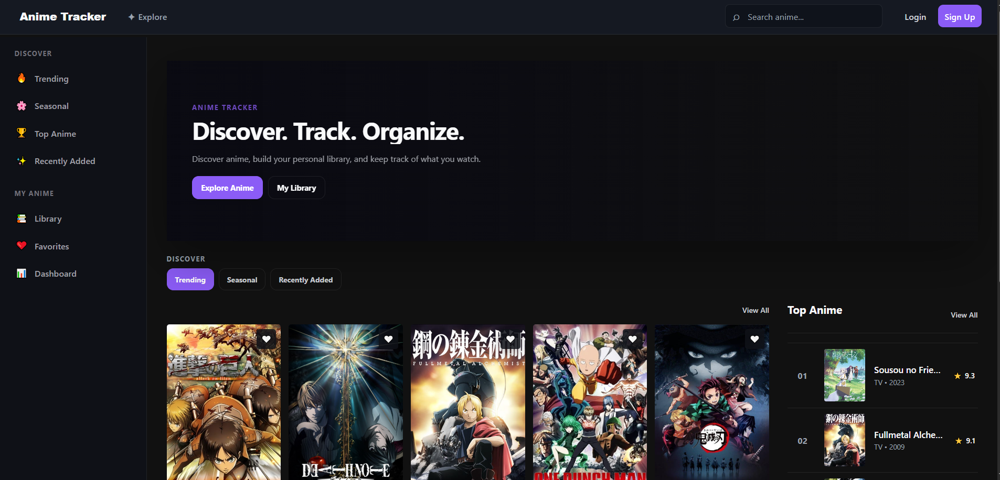
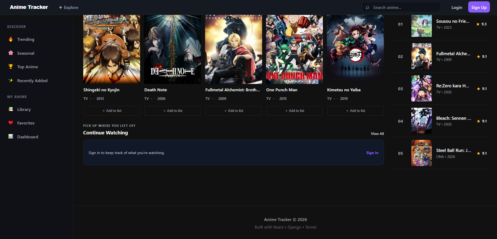
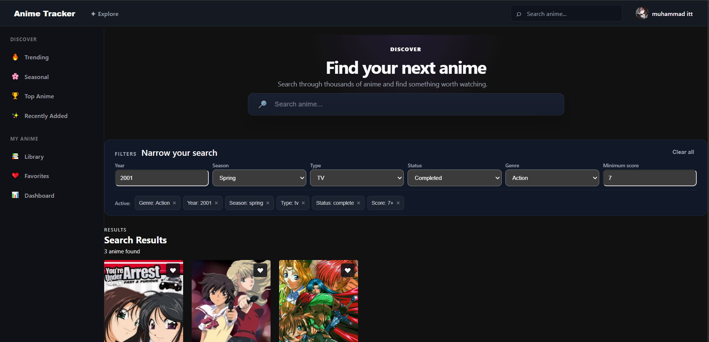
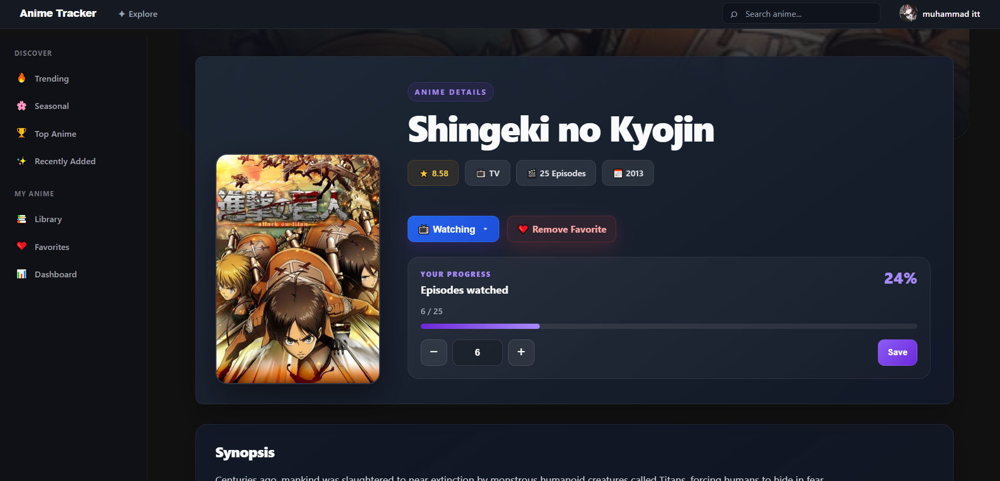
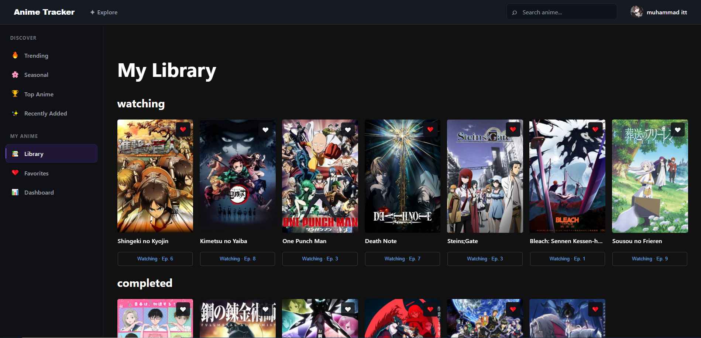
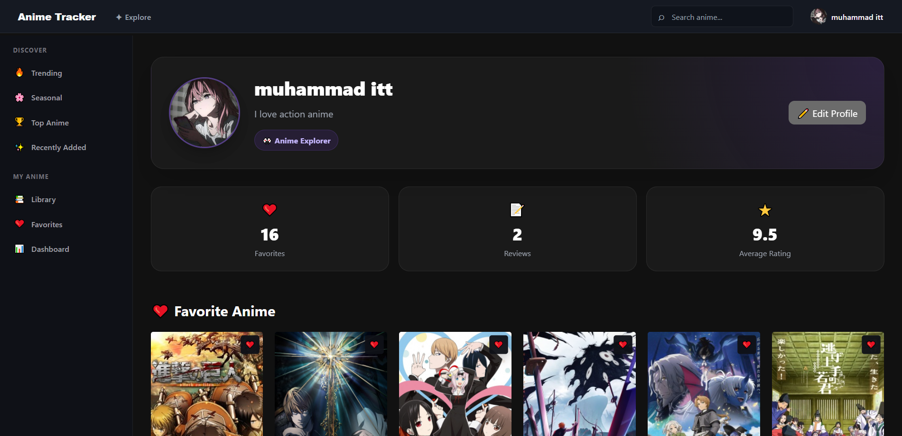
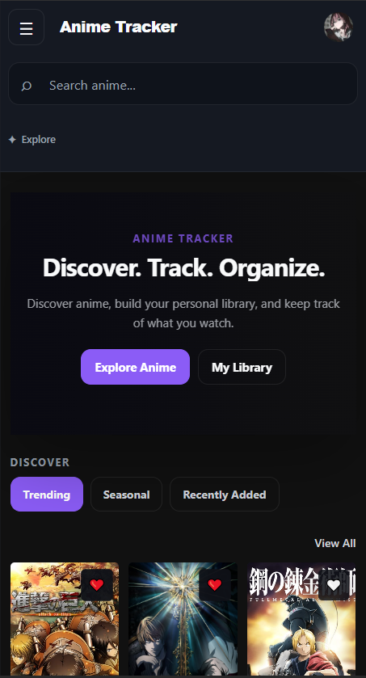

# Anime Tracker

[](https://github.com/Muhammad-Ismaeell/anime-tracker/actions/workflows/tests.yml)

A full-stack anime discovery and tracking platform built with **Django REST Framework** and **React**. It combines a searchable anime catalogue with personal library tracking, favourites, reviews, authentication, activity, statistics and detailed supplementary anime data.

**Status: Complete — portfolio-ready**

## Live Demo

**Web app:** https://anime-tracker-zeta-green.vercel.app

## What I Built

Anime Tracker was built as a real-world portfolio application rather than a simple CRUD demo. The project focuses on separating responsibilities, handling external API dependencies reliably, protecting authenticated requests and providing a responsive user experience.

Key engineering areas demonstrated:

- Layered Django backend with API, application-service and infrastructure boundaries
- Database-first persistence for core and selected supplementary anime data
- External anime API integration isolated behind a dedicated client
- Shared upstream request throttling and caching
- JWT refresh-token rotation, blacklisting and centralized Axios token refresh
- Relational constraints and indexes for data integrity and common query paths
- Responsive React UI with lazy-loaded routes and TanStack Query server-state management
- Automated backend tests plus frontend lint/build checks in GitHub Actions
- Docker and PostgreSQL-ready deployment configuration

## Screenshots

### Home & Discovery

<p align="center">
  
</p>

<p align="center">
  
</p>

---

### Search & Discovery

Users can search for anime and browse matching results with relevant information and artwork.

<p align="center">
  
</p>

---

### Anime Details

Each anime has a dedicated detail page containing its key information, synopsis, genres, ratings, and other relevant data.

<p align="center">
  
</p>

---

### Personal Library

Users can manage their anime library and keep track of their favorites and viewing status.

<p align="center">
  
</p>

---

### Profile & Activity

The profile provides an overview of the user's activity and interactions within the application.

<p align="center">
  
</p>

---

### Responsive Design

The interface is designed to adapt to different screen sizes and provide a usable experience on mobile devices.

<p align="center">
  
</p>

## Features

- Trending, seasonal, top and recently-added anime discovery
- Advanced search and filtering
- Anime detail pages with:
  - episodes
  - characters
  - staff
  - statistics
  - recommendations
  - relations
  - opening/ending themes
  - news
  - external links
- Personal library with watching status and episode progress
- Favourites
- Ratings and reviews
- User dashboard and activity feed
- User profiles and avatar uploads
- Local registration with email verification
- JWT authentication with refresh-token rotation and blacklisting
- Google authentication
- Protected routes and authenticated API requests
- Database-first persistence for core and selected supplementary anime data
- Backend and frontend caching
- Shared external API rate limiting
- Character safety filtering/caching
- Responsive desktop/mobile UI
- Lazy-loaded React routes and centralized server-state management
- OpenAPI/Swagger API documentation
- Automated backend tests with GitHub Actions
- Docker support

## Architecture

```text
Browser
   │
   ▼
React + Vite
   │ Axios / JSON
   ▼
Django + Django REST Framework
   │
   ├── Authentication / Users
   │       ├── JWT
   │       ├── Email verification
   │       └── Google authentication
   │
   ├── Anime API
   │       └── Application services
   │               ├── Database / Django ORM
   │               ├── Django cache
   │               └── Tenrai API client
   │
   └── PostgreSQL-ready configuration
           └── SQLite used for local development
```

The backend separates API/presentation concerns from application services and infrastructure integrations. External anime data is persisted locally when appropriate, while freshness windows and caching reduce unnecessary upstream requests.

See [docs/architecture.md](docs/architecture.md) for detailed request flows.

## Tech Stack

### Frontend

- React 19
- Vite 8
- React Router 7
- TanStack React Query 5
- Axios
- Framer Motion
- React Hot Toast
- Lucide React
- React Helmet Async
- Google OAuth
- CSS

### Backend

- Python 3.11
- Django 5.2
- Django REST Framework
- Simple JWT
- drf-spectacular / OpenAPI
- Django ORM
- SQLite for local development
- PostgreSQL-ready configuration via `dj-database-url` and `psycopg2-binary`
- Cloudinary for production media storage
- WhiteNoise
- Gunicorn
- Docker
- Pytest / pytest-django

### External services

- Tenrai API for anime data
- Google authentication
- Cloudinary media storage

## Repository Structure

```text
anime-tracker/
├── anime-frontend/
│   └── src/
│       ├── api/           # HTTP/API client functions
│       ├── app/           # application shell and routing
│       ├── auth/          # token/session helpers
│       ├── components/    # reusable UI components
│       ├── context/       # global providers
│       ├── hooks/         # reusable/server-state hooks
│       ├── lib/           # shared client utilities
│       ├── pages/         # route-level screens
│       └── utils/         # shared data/media utilities
│
├── backend/
│   ├── accounts/          # custom User model
│   ├── anime/
│   │   ├── api/           # API endpoints and OpenAPI serializers
│   │   ├── application/   # application services/business logic
│   │   ├── infrastructure/ # ORM, cache and external API integration
│   │   └── presentation/  # response normalization
│   ├── users/             # profile/library/favourite/review features
│   ├── core/              # auth, exceptions and shared backend code
│   ├── config/            # Django configuration
│   ├── Dockerfile
│   └── manage.py
│
└── docs/
    ├── architecture.md
    ├── api.md
    ├── database.dbml
    ├── development.md
    └── technical-decisions.md
```

## Local Setup

### Backend

```bash
git clone https://github.com/Muhammad-Ismaeell/anime-tracker.git
cd anime-tracker/backend
python -m venv venv
```

Activate the virtual environment.

**Windows:**

```powershell
venv\Scripts\activate
```

**Linux/macOS:**

```bash
source venv/bin/activate
```

Install development dependencies:

```bash
python -m pip install -r requirements-dev.txt
```

Create `backend/.env` from `backend/.env.example`, then run:

```bash
python manage.py migrate
python manage.py runserver
```

The backend runs at `http://127.0.0.1:8000/`.

### Frontend

In another terminal:

```bash
cd anime-frontend
npm install
```

Create `.env` from `.env.example` and configure the API/media URLs and Google client ID.

Start the development server:

```bash
npm run dev
```

The frontend normally runs at `http://localhost:5173/`.

## API Documentation

The backend exposes OpenAPI documentation:

```text
http://127.0.0.1:8000/api/docs/
```

The raw schema is available at:

```text
http://127.0.0.1:8000/api/schema/
```

Main API groups:

- `/api/auth/` — authentication and email verification
- `/api/anime/` — discovery, search, detail and supplementary anime data
- `/api/users/` — profile, library, favourites, reviews, activity and dashboard

See [docs/api.md](docs/api.md) for a concise endpoint reference.

## Testing & CI

Backend tests:

```bash
cd backend
pytest -q
```

Frontend checks:

```bash
cd anime-frontend
npm run lint
npm run build
```

GitHub Actions runs Django tests plus frontend lint/build checks on pushes and pull requests.

## Data & Caching Strategy

The application uses a database-first approach for data that benefits from persistence. Core anime records and selected supplementary records are stored locally and refreshed according to feature-specific freshness windows.

The backend cache reduces repeated work and external API calls. TanStack Query provides browser-side server-state caching. These layers complement each other: frontend caching reduces duplicate browser requests, while backend caching reduces duplicate server/external work.

The external API client applies a shared request interval and lock to avoid uncontrolled bursts. This is particularly useful during concurrent development requests against the upstream provider.

## Security & Reliability

- Environment variables are used for secrets and deployment-specific configuration.
- `.env`, SQLite databases, uploaded media and generated static files are excluded from version control.
- Production security settings enable HTTPS redirects, secure session/CSRF cookies and HSTS when `DEBUG=False`.
- CORS is explicitly configured.
- JWT refresh tokens are rotated and blacklisted after use.
- Local accounts require email verification before login.
- The frontend centralizes JWT handling and access-token refresh in Axios interceptors.
- Concurrent requests waiting for an expired token share a single refresh operation.
- React uses an error boundary and loading fallbacks.
- Database constraints prevent duplicate user/anime statuses, favourites, reviews and supplementary records.

## Database Diagram

The application/domain ERD is available as [docs/database.dbml](docs/database.dbml) and can be opened in [dbdiagram.io](https://dbdiagram.io/).

The diagram intentionally excludes Django's internal permission, session, admin and migration tables so that it focuses on the application's domain model.

## Technical Decisions

See [docs/technical-decisions.md](docs/technical-decisions.md) for the reasoning behind:

- database-first persistence
- external-provider identifiers
- the service layer
- API-client isolation
- rate limiting
- caching
- JWT refresh handling
- SQLite development vs PostgreSQL deployment
- React Query and lazy-loaded routes

## Development Guide

See [docs/development.md](docs/development.md) for environment setup, Docker usage, testing, migrations and pre-PR checks.

## Current Scope

This is a portfolio-scale application. The current design deliberately avoids infrastructure complexity that is not needed at this scale. If the project grows, natural next steps include PostgreSQL as the primary deployed database, Redis for distributed caching, background jobs, observability and additional integration tests.

## Attribution

Anime metadata is provided by the Tenrai API. This is an independent portfolio project and is not affiliated with Tenrai, MyAnimeList, anime studios or publishers represented in the data.
