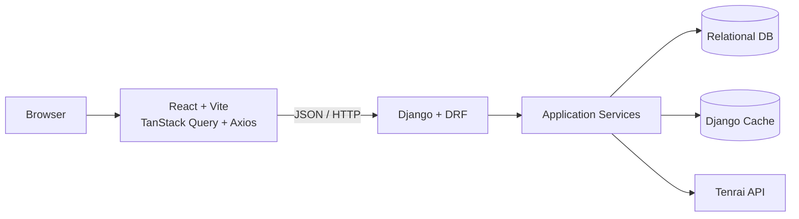
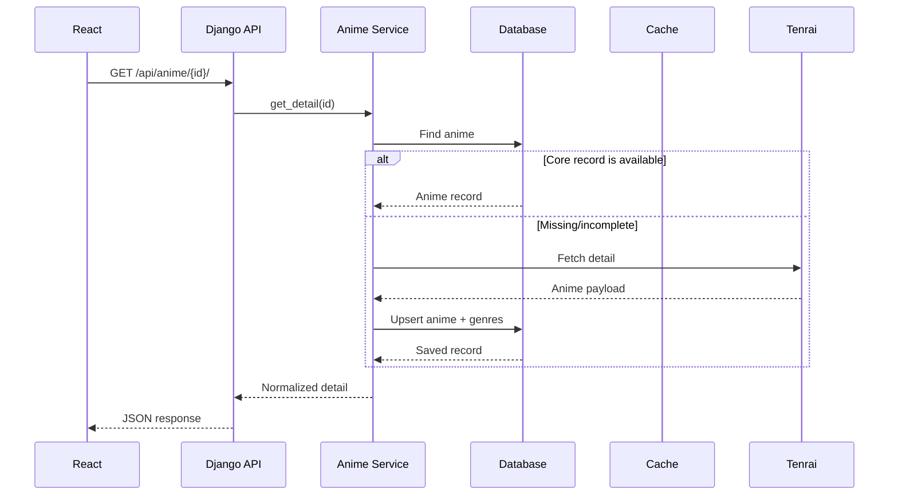

# Architecture

## Overview

Anime Tracker is a full-stack application with a React client, a Django REST API, a relational database, an application cache, and an external anime-data provider.



## Frontend layers

```text
anime-frontend/src/
├── api/          HTTP/API client functions
├── app/          application shell and routing
├── auth/         token and authentication helpers
├── components/   reusable UI components
├── context/      global UI/session providers
├── hooks/        reusable and server-state hooks
├── lib/          shared client utilities
├── pages/        route-level screens
└── utils/        presentation/data helpers
```

TanStack Query owns server state such as anime details, discovery lists and supplementary data. Axios provides the HTTP client and centralizes JWT attachment and access-token refresh behavior.

Routes are lazy-loaded so the initial bundle does not need to load every page immediately. Authenticated pages are wrapped by `ProtectedRoute`.

## Backend layers

The backend is organized around application/domain concerns rather than putting all logic in views.

```text
backend/
├── accounts/             custom Django user model
├── anime/
│   ├── api/              API views, URL routing and OpenAPI serializers
│   ├── application/      anime business logic/services
│   ├── infrastructure/  ORM models, cache and external API integration
│   └── presentation/     response normalization
├── users/                user features and persistence
├── core/                 auth, shared exceptions and common infrastructure
└── config/               Django project configuration
```

## Request flow: anime detail



Selected supplementary data follows the same database-first principle. Relations, themes, external links and staff are persisted and refreshed using freshness windows. This reduces repeated external calls and makes repeat page visits more reliable.

## Request flow: authenticated user action

```text
React
  ↓ Axios
Django authentication middleware / DRF permission
  ↓
User endpoint
  ↓
User application logic
  ↓
Django ORM
  ↓
JSON response
  ↓
TanStack Query / local UI state
```

JWT access tokens are attached by the Axios request interceptor. When an authenticated request receives a 401, the client uses a separate refresh client so the refresh request cannot recursively trigger the normal auth interceptor. Concurrent failed requests are queued behind the active refresh operation.

## External API integration

The external provider is accessed through `JikanClient` in the infrastructure layer. The class name remains for compatibility with the existing project structure; the configured provider is Tenrai.

The client applies a shared request interval and lock around external requests. Application services decide when external data is needed, while the database/cache layer prevents unnecessary calls where persisted data is fresh enough.

## Caching

There are two relevant caching layers:

1. **Django cache** — backend response/data caching with feature-specific freshness windows.
2. **TanStack Query** — frontend server-state caching, including global defaults and longer freshness for relatively stable supplementary data.

The two layers are complementary. Frontend caching avoids repeated browser requests; backend caching avoids repeated database/external work when a request does arrive.

## Database strategy

SQLite is used for local development because it is simple and requires no separate database server. The project is PostgreSQL-ready through `dj-database-url` and `psycopg2-binary`; the production configuration reads `DATABASE_URL` when `DEBUG=False`.

A local SQLite write lock is used around selected supplementary-data writes to prevent concurrent write contention during development. This is a single-process development safeguard, not a distributed locking mechanism.

See [database.dbml](database.dbml) for the application/domain ERD.

## Reliability considerations

- External requests are rate-limited and serialized through a shared client limiter.
- API responses use explicit error handling and centralized exception translation.
- Authentication refresh requests are isolated from the main Axios interceptor.
- React routes use an error boundary and loading fallbacks.
- Persisted supplementary data has freshness windows instead of being fetched on every request.
- Database constraints prevent duplicate user/anime statuses, favourites, reviews and supplementary records.

## Production evolution

The current design is appropriate for a portfolio-scale deployment. If traffic grows, the natural next steps are PostgreSQL as the primary database, Redis for distributed caching/coordination, background jobs for refresh work, and stronger observability around external API latency and failures.
